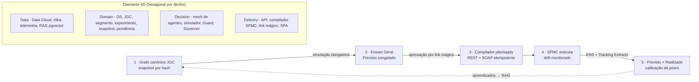

# Jornada 🧬

[](https://github.com/sergiogaiotto/jornada/actions/workflows/ci.yml)

**Digital Twin do Journey Builder (Salesforce Marketing Cloud) — o acelerador fim-a-fim de campanhas da Claro.**

Toda campanha é *pensada, discutida, criada, avaliada, configurada, disparada, monitorada e otimizada* dentro do twin; o SFMC vira o **runtime de execução**, nunca mais a mesa de desenho. Construído por **Spec-Driven Development**: o contrato completo está em [`SDD-Jornada.md`](SDD-Jornada.md), cada decisão em [`CHANGELOG-SDD.md`](CHANGELOG-SDD.md), e **cada critério de aceite do SDD é um teste automatizado com o mesmo ID** (`test_M5_A3`). Divergir do SDD sem emendá-lo é bug.

**🌐 Demo pública:** http://vps.falagaiotto.com.br:8050 · Observabilidade dos agentes (Langfuse): http://vps.falagaiotto.com.br:13000
*Dados 100% sintéticos; autenticação de demonstração; a campanha-exemplo OS-2026-0457 vem semeada de ponta a ponta. Os agentes de IA rodam no HubGPU real (gpt-oss-120B/20B).*

---

## Os 3 princípios inegociáveis

1. **O twin é a fonte da verdade** — a jornada é um grafo canônico JSON (**JGC**, SDD §5) versionado, com snapshot imutável por hash. Ninguém edita o SFMC diretamente: um **compilador determinístico plan/apply** materializa o grafo (Data Extensions, Event Definitions, Journey, assets) com externalKeys idempotentes, e um **monitor de drift** acusa qualquer edição feita por fora. *Aprovado = publicado = em execução.*
2. **Nada dispara sem ensaio** — a **simulação Monte Carlo** (reprodutível por seed) é portão obrigatório e congela o "Previsto" (P10/P50/P90 de funil, custo, ROAS). Todo KPI do pós-disparo é um par **previsto × realizado**, e o erro recalibra o simulador (closed loop).
3. **IA copilota, humano aprova** — mesh de agentes (Maestro → Triagem → Especialista) sempre como **prévia/diff com Aplicar/Rejeitar**, premissas editáveis e ledger **`via_ai`** reconstruível (LGPD Art. 20). **Compliance é código determinístico, nunca LLM** — o Guard das 7 listas de supressão funciona com o hub de IA fora do ar.

## Arquitetura — Diamante 4D + loop do twin



**Mesh de agentes** (SDD §7): Consultor de Campanhas (intake), Engineer (SQL do público), Activate, Flow (gera o JGC), Visual/Copy/Content, Simulate+Persona, Sync/Publish, Insight (NL→consulta nomeada, nunca SQL livre), Optimize (propor é a única ação autônoma), Calibrate, Cost, Doc — e o **Guard, que não é LLM**. Skills versionadas em `SKILL.md`, harness com golden dataset como portão de release, tudo com retry §7.3 (reprompt com o veredito do validador determinístico).

## As 18 telas

| Fase | Telas |
|---|---|
| Portfólio | T1 Cockpit (kanban, saúde derivada — nunca editável) |
| 1 · Pensada | T2 Sala de Ideação (Consultor IA, briefing dinâmico, medidor de completude) |
| 2 · Discutida | T3 Validação campo-a-campo (✓ contagem · ✓ schema · ✓ frescor) · T4 War Room (GO congela SLAs e versões) |
| 3 · Criada | T5 Audiência (waterfall das 7 listas + SQL + Guard) · T5a Data Cloud (relatório de público e **volume de abordagem**) · T6 Criativo (matriz canal×variante) · T7 **Canvas do Twin** (React Flow, paleta Journey Builder, taxímetro) |
| 4 · Avaliada | T8 Ensaio Geral (Monte Carlo) · T9 Portões (LGPD, experimento, custo/alçada, Governor) · T10 Aprovação (link mágico standalone) |
| 5 · Configurada | T11 Pré-voo (plan/apply com diff, seed test, drift zero) |
| 6 · Disparada | T12 Torre de Lançamento (rampa canário 1→10→100%, breakers, kill switch) |
| 7 · Monitorada | T13 Monitor (todo KPI previsto×realizado, IC95) · T14 Pergunte aos Dados · T15 Otimização & Retro (anti-peeking, clonar com aprendizados) |
| Transversal | T4a Esteira de Produção (workflow ex-Hike) · T16 Ateliê de Agentes |

**Guia Interativo** embutido (padrão Maestro): 🎯 Tour das páginas com spotlight no menu · 📚 Guia dos Módulos · 💡 Ajuda contextual por tela (O que é, Fundamentos, Campos, Casos de uso, Exemplo prático, Pegadinhas) · ✨ "IA, me ajude com esta página" (chat no gpt-oss-20B com o contexto da tela).

## Stack

| Camada | Tecnologia |
|---|---|
| Backend | Python 3.11 · FastAPI (OpenAPI em `/docs`) · arquitetura hexagonal · RFC-7807 |
| Agentes | LangGraph + Deep-Agent Harness · **HubGPU on-prem**: gpt-oss-120B (especialistas/judge) e 20B (triagens/UI) via endpoint OpenAI-compatible (`api_key: not-needed`) |
| RAG | PostgreSQL + pgvector · Qwen3-Embedding-0.6B (1024 dims, collection `agente_evidence`) |
| Frontend | Vite + React 18 + TypeScript · Tailwind (chrome vermelho Claro) · @xyflow/react (paleta Journey Builder) · Recharts (barra fantasma previsto × sólida realizado) · TanStack Query · zustand |
| Observabilidade | **Langfuse self-hosted** — 1 trace por invocação (`trace_id = invocacao.id`), spans `rag_retrieve → generate → judge`, fire-and-forget (queda do Langfuse nunca derruba o app) |
| Integrações | SFMC REST + SOAP (mock server com injeção de caos p/ dev) · Salesforce Data Cloud (Segmentation/Query API, mock) · importador de workflows do Hike |
| CI/CD | GitHub Actions: ruff + mypy + pytest (cobertura ≥80%) + build front + validação compose → **deploy automático na VPS via SSH** a cada push verde na main |

## Estrutura do repositório

```
├── SDD-Jornada.md            # o contrato (Spec-Driven Development)
├── CHANGELOG-SDD.md          # toda emenda/decisão, datada
├── docs/UAT-VPS-2026-08-05.md# UAT via UI: 10 use cases, 18 achados, reteste
├── docker-compose.yml        # dev: db(pgvector), api, mocks, mailpit, langfuse
├── docker-compose.prod.yml   # demo VPS: web(nginx+SPA):8050, api, mocks, langfuse:13000
├── deploy/deploy.sh          # deploy por git clone/reset na VPS
├── backend/
│   ├── domain/               # puro, sem I/O (campanha, jornada/JGC, simulação…)
│   ├── application/          # ports (Protocols) + services (casos de uso)
│   ├── adapters/             # llm/hubgpu, sfmc, datacloud, langfuse, persistence
│   ├── agents/               # skills/*.skill.md, guard/ (sem LLM), harness/
│   ├── api/v1/               # routers por módulo (M0–M12 do SDD §8)
│   ├── migrations/           # alembic (DDL completo §4.1)
│   └── tests/                # unit · contract (golden files SFMC) · acceptance (test_MX_AN)
├── frontend/                 # SPA 18 telas + Guia Interativo
└── mocks/                    # sfmc-server (REST+SOAP+chaos), datacloud-server, seeds
```

## Rodando localmente

```bash
git clone https://github.com/sergiogaiotto/jornada.git && cd jornada
cp .env.example .env             # endpoints do HubGPU já preenchidos; ajuste se necessário
docker compose up -d             # db, api:8000, mock-sfmc, mock-datacloud, mailpit, langfuse:3000
cd frontend && npm ci && npm run dev   # SPA em http://localhost:5173 (proxy /api → :8000)
```

Com `DEMO_MODE=true` (padrão), a **OS-2026-0457 · Upgrade Pós-Pago 5G** nasce semeada de ponta a ponta — briefing 14 campos → GO → certificado LGPD → grafo no canvas → previsto congelado → rampa → monitor com lift +24,1pp (IC95) e ROAS 18,5x. IDs de seed são **determinísticos** (uuid5): links sobrevivem a restarts.

**Testes e qualidade:**

```bash
cd backend && python -m pytest -m "not integration" -q   # 156+ testes; aceites = IDs do SDD
python -m ruff check . && python -m ruff format --check .
python -m mypy app api
```

Sem o hub LLM acessível, os agentes degradam para **503 + modo manual** (SDD §10.6) — o caminho crítico (Guard, compilador, breakers, kill switch) é 100% determinístico e segue funcionando; um teste e2e prova isso com `LLM_DEGRADED_MODE=forced_off`.

## Deploy (VPS)

```bash
curl -fsSL https://raw.githubusercontent.com/sergiogaiotto/jornada/main/deploy/deploy.sh | bash -s -- --local
```

Sobe `web` (nginx servindo a SPA + proxy `/api`, porta **8050**), `api`, mocks e Langfuse (**:13000**, signup desabilitado; segredos gerados na própria VPS, fora do git). Em produção contínua, o job `deploy` do CI faz isso automaticamente a cada push verde na main (chave SSH em secret, smoke pós-deploy). HTTPS: server block nginx + certbot prontos (aguardando DNS `jornada.falagaiotto.com.br`).

## Estado & histórico

- **Milestones auditados** `vMS5`–`vMS8`: M0–M12 do SDD implementados com auditoria cética por milestone.
- **Validação com o hub real** (2026-08-05): 120B/20B/embeddings confirmados; 3 achados que só o modelo real revela (reasoning tokens, "conversa sem estruturar" → retry §7.3, timeout → 503) corrigidos.
- **UAT via UI na VPS** (2026-08-05): 10 use cases, **18 achados** (7 invisíveis a testes sintéticos), 9 corrigidos e retestados no mesmo dia — relatório completo em [`docs/UAT-VPS-2026-08-05.md`](docs/UAT-VPS-2026-08-05.md).

**Pendências conhecidas (top-3 do produto):**
1. **Persistência PostgreSQL** — repositórios de demo são em memória; redeploy apaga OSs não-seed (A7). O DDL/migrações já existem (§4.1).
2. **Porta de entrada do solicitante na UI** — criação de pedido hoje só via API/portal (A3).
3. **RAG em produção** — pgvector + ingestão do dicionário de dados (o Engineer recusa honestamente sem evidência — A11).

## Documentos

| Documento | O que é |
|---|---|
| [`SDD-Jornada.md`](SDD-Jornada.md) | O contrato de engenharia: arquitetura, DDL, JGC, módulos M0–M12 com aceites, NFRs, milestones |
| [`CHANGELOG-SDD.md`](CHANGELOG-SDD.md) | Emendas ao contrato e decisões de implementação, datadas |
| [`docs/UAT-VPS-2026-08-05.md`](docs/UAT-VPS-2026-08-05.md) | UAT profundo via UI: use cases, achados, reteste |
| Plano funcional (Martech v1.2.1) | Mocks navegáveis das 18 telas + crítica da spec original (artifact privado do projeto) |

---

*Projeto de estudo/aceleração construído em pair com IA (Claude) sob Spec-Driven Development — especificação primeiro, auditoria cética por milestone, e a regra de ouro: LLM nunca decide elegibilidade de contato, nunca publica sozinho, nunca altera jornada no ar.*
