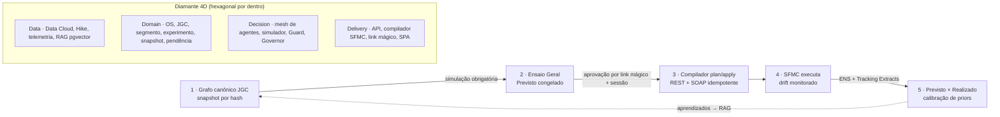

# Jornada 🧬

[](https://github.com/sergiogaiotto/jornada/actions/workflows/ci.yml)

**Digital Twin do Journey Builder (Salesforce Marketing Cloud) — o acelerador fim-a-fim de campanhas da Claro.**

Toda campanha é *pensada, discutida, criada, avaliada, configurada, disparada, monitorada e otimizada* dentro do twin; o SFMC vira o **runtime de execução**, nunca mais a mesa de desenho. Construído por **Spec-Driven Development**: o contrato completo está em [`SDD-Jornada.md`](SDD-Jornada.md), cada decisão em [`CHANGELOG-SDD.md`](CHANGELOG-SDD.md), e **cada critério de aceite do SDD é um teste automatizado com o mesmo ID** (`test_M7_A2`). Divergir do SDD sem emendá-lo é bug.

**🌐 Demo pública:** http://vps.falagaiotto.com.br:8050 · Observabilidade dos agentes (Langfuse): http://vps.falagaiotto.com.br:13000
*Dados 100% sintéticos; autenticação de demonstração; a campanha OS-2026-0457 vem semeada de ponta a ponta. Os agentes de IA rodam no HubGPU real (gpt-oss-120B/20B).*

---

> **Este README é um livro.** Ele existe para que quem chega — dev, DPO, revisor, curioso — entenda **por que** o sistema é do jeito que é, não só o que ele faz. Onde há decisão contra-intuitiva, o motivo está escrito, quase sempre porque a alternativa óbvia já falhou e custou um achado. Leia por partes; o [Sumário](#sumário) é a porta de entrada.

## Sumário

- **[Parte I — A visão](#parte-i--a-visão)** · [Os 3 princípios](#os-3-princípios-inegociáveis) · [Da ideia ao disparo](#da-ideia-ao-disparo--o-fluxo-em-uma-imagem) · [As 8 fases](#o-ciclo-de-vida--8-fases)
- **[Parte II — O produto](#parte-ii--o-produto)** · [As 18 telas](#as-18-telas) · [Destaques](#destaques-do-produto)
- **[Parte III — A arquitetura](#parte-iii--a-arquitetura)** · [Diamante 4D + loop](#diamante-4d--loop-do-twin) · [Hexagonal](#hexagonal-por-dentro) · [Mesh de agentes](#o-mesh-de-agentes) · [O JGC](#o-jgc--o-coração-do-twin)
- **[Parte IV — Governança, IA Responsável e LGPD](#parte-iv--governança-ia-responsável-e-lgpd)** · [As 5 travas](#as-5-travas-da-política-de-ia-responsável) · [Guard e Governor](#guard-e-governor--compliance-é-código) · [Segregação](#segregação-criador--aprovador) · [Auditoria](#auditoria-via_ai-e-reconstrução-art-20) · [Purge](#retenção-de-dados-104) · [Backup](#backup-e-restauração-102) · [TLS](#tls-103)
- **[Parte V — Operação e deploy](#parte-v--operação-e-deploy)** · [Rodando local](#rodando-localmente) · [Deploy VPS](#deploy-vps)
- **[Parte VI — Stack e API](#parte-vi--stack-e-api)**
- **[Parte VII — A disciplina](#parte-vii--a-disciplina-como-o-projeto-é-construído)** · [SDD](#spec-driven-development) · [Gates no container](#gates-no-container-a-lição-que-custou-dois-achados) · [Auditoria cética](#auditoria-cética-por-onda) · [História: ondas 1–6](#a-história-em-ondas)
- **[Parte VIII — Contribuindo](#parte-viii--contribuindo)** · [Glossário](#glossário-do-vocabulário-canônico)

---

# Parte I — A visão

## Os 3 princípios inegociáveis

1. **O twin é a fonte da verdade** — a jornada é um grafo canônico JSON (**JGC**, SDD §5) versionado, com snapshot imutável por hash. Ninguém edita o SFMC diretamente: um **compilador determinístico plan/apply** materializa o grafo (Data Extensions, Event Definitions, Journey, assets) com externalKeys idempotentes, e um **monitor de drift** acusa qualquer edição feita por fora. *Aprovado = publicado = em execução.*
2. **Nada dispara sem ensaio** — a **simulação Monte Carlo** (reprodutível por seed) é QA obrigatório e congela o "Previsto" (P10/P50/P90 de funil, custo, ROAS). Todo KPI do pós-disparo é um par **previsto × realizado**, e o erro recalibra o simulador (closed loop).
3. **IA copilota, humano aprova** — mesh de agentes (Maestro → Triagem → Especialista) sempre como **prévia/diff com Aplicar/Rejeitar**, premissas editáveis e ledger **`via_ai`** reconstruível (LGPD Art. 20). **Compliance é código determinístico, nunca LLM** — o Guard das 7 listas de supressão funciona com o hub de IA fora do ar.

## Da ideia ao disparo — o fluxo em uma imagem

```mermaid
flowchart LR
  NC["➕ Nova Campanha<br/>conversa com o Consultor<br/>OU formulário direto"] -->|completude 100%| OS["OS criada<br/>briefing dinâmico"]
  OS --> VAL["Validação campo a campo<br/>✓ contagem · ✓ schema · ✓ frescor"]
  VAL -->|pendência bloqueia| GO["GO no War Room<br/>congela SLAs e versões"]
  GO --> PROD["Audiência + Criativo<br/>+ Canvas do Twin"]
  PROD --> SIM["Ensaio Geral<br/>Previsto congelado"]
  SIM --> QA["QA: LGPD · experimento<br/>custo/alçada · Governor"]
  QA --> APR["Aprovação<br/>link mágico + sessão"]
  APR --> PRE["Pré-voo plan/apply<br/>drift zero"]
  PRE --> RAMP["Rampa canário<br/>1% → 10% → 100%"]
  RAMP --> MON["Monitor<br/>previsto × realizado"]
  MON -->|aprendizados → RAG| NC
```



## O ciclo de vida — 8 fases

Cada campanha (OS) atravessa oito fases, e **transições só acontecem com os QAs da fase satisfeitos** — não há como pular um portão:

`Pensada → Discutida → Criada → Avaliada → Configurada → Disparada → Monitorada → Encerrada`

A **saúde** de uma OS nunca é digitada: é derivada em tempo real de pendências bloqueantes abertas e SLAs estourados. Não existe botão para "pintar de verde".

---

# Parte II — O produto

## As 18 telas

| Fase | Telas |
|---|---|
| Portfólio | T1 Cockpit (+ Nova Campanha, fila de pedidos, kanban, saúde derivada — nunca editável) |
| 1 · Pensada | T2 Sala de Ideação (Consultor IA **ou** formulário inline, medidor de completude, janela estruturada, converter em OS) |
| 2 · Discutida | T3 Validação campo-a-campo (✓ contagem · ✓ schema · ✓ frescor; pendência bloqueia) · T4 War Room (GO congela SLAs e versões) |
| 3 · Criada | T5 Audiência (waterfall das 7 listas + SQL + Guard) · T5a Data Cloud (relatório de público e **volume de abordagem**) · T6 Criativo (matriz canal×variante) · T7 **Canvas do Twin** (editor JB completo — ver destaques) |
| 4 · Avaliada | T8 Ensaio Geral (Monte Carlo, seed reprodutível) · T9 **QA** (LGPD, experimento, custo/alçada, Governor) · T10 Aprovação (link mágico + **sessão do aprovador**, uso único) |
| 5 · Configurada | T11 Pré-voo (plan/apply com diff, seed test, drift zero) |
| 6 · Disparada | T12 Torre de Lançamento (rampa canário 1→10→100%, breakers, kill switch 2 etapas) |
| 7 · Monitorada | T13 Monitor (todo KPI previsto×realizado, IC95) · T14 Pergunte aos Dados (consulta nomeada + query visível) · T15 Otimização & Retro (anti-peeking HTTP 425, clonar com aprendizados) |
| Transversal | T4a Esteira de Produção (workflow ex-Hike) · T16 Ateliê de Agentes (roster, harness, IA Responsável, **auditoria via_ai**) |

Cada tela tem um **Guia Interativo** embutido (`frontend/src/guia/`): abas *O que é · Fundamentos · Campos da tela · Casos de uso · Exemplo prático · Pegadinhas*, essas últimas escritas a partir dos achados reais dos UATs.

## Destaques do produto

### ➕ Nova Campanha nativa
Botão primário no Cockpit (e na busca ⌘K): cria o pedido e abre a **Sala de Ideação em modo pedido** — converse com o Consultor (120B extrai os campos com evidência "informado pelo solicitante") **ou preencha o formulário direto** (edição inline, Enter salva). O **medidor de completude** sobe ao vivo com os faltantes como chips clicáveis; a 100%, **"Converter em OS"**. O briefing aceita, além do texto livre da janela, dois campos ISO opcionais (`janela_inicio`/`janela_fim`) que ligam a regra de wait × janela no canvas.

### 🎨 Canvas do Twin — editor nível Journey Builder
- **Paleta de atividades** arrastável nas categorias JB (entry verde, mensagens teal, flow control laranja, otimização roxa, updates azul), com busca;
- **CRUD visual completo**: drop cria nó, arestas por drag, Delete remove, Ctrl+D duplica, **Ctrl+Z/Y** (histórico de 50 passos), auto-layout, MiniMap;
- **Inspetor por tipo de nó** (formulários do §5.2 — split validando Σ pcts = 100, opt-in por canal, waits) e **lint em tempo real** clicável (o 422 do servidor cai no mesmo painel);
- **Validação por VALOR, não só por presença** (onda 5): o `jgc.schema.json` roda inteiro a cada save — pct fora de 0–100, `janelaHoras` negativa, métrica fora do enum, throttle como texto, campo desconhecido viram 422 apontando o nó. Antes bastava o campo existir; agora o valor precisa fazer sentido;
- **Roteamento sem ambiguidade**: um `decisionSplit` roteia OU pela regra OU pela aresta, nunca as duas no mesmo nó — o editor bloqueia a conexão que criaria o híbrido (que duplicava a saída no SFMC), e o save recusa com `roteamento_ambiguo`;
- **Versionamento**: dropdown de versões, versões antigas read-only, **restaurar cria versão nova (nunca sobrescreve)** e **diff visual pintado no próprio canvas** (verde=adicionado, fantasma vermelho=removido, âmbar=alterado). O **hash é insensível à ordem** de nós e arestas: reordenar o desenho não cria versão nem mexe no SFMC — salvar o mesmo grafo é **no-op**, não versiona nem invalida o Ensaio. Desde a onda 7 (D06), **todo save mina versão nova**: a origem sai intacta e o histórico registra cada passo, o que fecha por construção a janela em que editar depois do snapshot publicava no SFMC um grafo não aprovado. Ressalva que fica: o "read-only" da versão antiga é guarda de tela, não do servidor;
- **Simulação integrada**: overlay dos volumes por aresta da última rodada do Ensaio (espessura proporcional), invalidado ao salvar;
- **Exportação**: **XML canônico validado por XSD** (com manifest: hash JGC, versão, timestamp — determinístico byte a byte) e **JSON na spec de interaction do JB** (o formato de import nativo da Salesforce);
- **Taxímetro** sempre visível: Σ volume × tarifa por canal, recalculado a cada mudança.

### 🧭 Guia Interativo (padrão Maestro)
🎯 **Tour das páginas** com spotlight no menu · 📚 **Guia dos Módulos** · 💡 **Ajuda desta página** (6 abas, com **Pegadinhas** dos achados reais) · ✨ **"IA, me ajude com esta página"** (chat no 20B com o contexto da tela, degradação educada sem hub).

---

# Parte III — A arquitetura

## Diamante 4D + loop do twin



## Hexagonal por dentro

O backend é hexagonal e a regra é rígida: **`domain/` é código puro** (zero I/O, zero LLM, testável sem app); **`application/ports/`** são Protocols Python; **`application/services/`** são os casos de uso; **`adapters/`** implementam as portas (HubGPU, SFMC, Data Cloud, Langfuse, Postgres). O portão de IA Responsável e o Guard vivem em pastas que os testes-vigia varrem por AST — um serviço novo que chame o LLM sem passar pelo portão é reprovado no CI, não em produção.

## O mesh de agentes

**SDD §7:** Consultor de Campanhas (intake conversacional), Engineer (SQL do público), Activate, Flow (gera o JGC), Visual/Copy/Content, Simulate+Persona, Sync/Publish, Insight (NL→consulta nomeada, nunca SQL livre), Optimize (propor é a única ação autônoma), Calibrate, Cost, Doc, Ajuda (chat do Guia) — e o **Guard, que não é LLM**. Skills versionadas em `SKILL.md`, harness com golden dataset como QA de release, tudo com **retry §7.3** (reprompt com o veredito do validador determinístico — nascido de bugs reais do modelo em produção).

Toda chamada ao modelo grava uma linha de ledger `invocacao` com o **consumo de tokens** medido (o painel da T16 exibe tokens e latência por invocação; ausência de medida aparece como "—", nunca como zero). A política pode fixar um **teto diário de tokens por tenant** — atingido, a próxima chamada é recusada com 429 antes de custar.

## O JGC — o coração do twin

O **Journey Graph Canônico** é JSON versionado, com hash content-addressable. A partir dele tudo se deriva:

- **Validação (`jgc_validate`, §5.3)** roda a cada save, em duas naturezas. A **estrutural** valida o grafo inteiro contra o `jgc.schema.json` (fonte da verdade, Draft 2020-12) — por **valor**, não só por presença: tipo, faixa, enum, forma e chaves desconhecidas. A **semântica** cobre o que schema não expressa: braço órfão, soma de pcts ≠ 100, canal sem opt-in, grafo sem goal, `wait` além da janela da oferta, roteamento ambíguo, contrato de re-entrada.
- **Hash canônico (`canonico.py`)**: `nodes` e `edges` são conjuntos — o mesmo grafo em outra ordem é o mesmo grafo, mesmo hash, mesmo `externalKey`. Sem isso, reordenar o desenho geraria um plan destrutivo no SFMC ("reinicia contatos em espera") para um grafo idêntico.
- **Compilador plan/apply (§5.4, determinístico — LLM proibido)**: resolve dependências (DEs → EventDef → Assets → Journey → Automations), gera `{recurso, ação, aviso}` com `externalKey = jrn-{hash}-{noId}` (idempotência), aplica com backoff e rollback compensatório, e a verificação de **drift** decompila o estado real e compara por hash — divergência em prod abre pendência bloqueante. **Sob demanda, não agendada:** o drift roda quando alguém chama `GET /drift` (o botão do Pré-voo); o job de 30 min do §5.4.5 não existe — nenhum cron o instala, e a tela nasce com a consulta desligada.
- **Simulador (§6, Monte Carlo)**: portão obrigatório, reprodutível por seed, congela o Previsto (P10/P50/P90). Consome as mesmas regras de validação — inclusive a janela da oferta.

---

# Parte IV — Governança, IA Responsável e LGPD

> A tese do projeto: **parametrização que não muda comportamento é pior que nenhuma — vira teatro auditável.** Cada trava abaixo existe porque um teste prova, por inversão, que ela muda o comportamento; e cada campo só entra na política junto com o enforcement que o faz valer.

## As 5 travas da política de IA Responsável

A política de IA (tela do DPO na T16, `draft → publicada`, versionada com autor e motivo) governa cinco parâmetros — cada um é um **enforcement** no caminho de execução, não um flag inerte:

| Trava | O que faz |
|---|---|
| **`dados_llm`** | PII de categoria marcada `bloquear` impede a chamada ao modelo (mascarar deixa sair marcado; bloquear é a única ação que impede a saída). A detecção tem **duas naturezas**: por *forma* (CPF/CNPJ/e-mail/telefone/cartão/CEP/RG — verificável, com dígito verificador e Luhn) e por *contexto* (nome/endereço/data de nascimento — probabilística, com limites nomeados exibidos ao lado do seletor). |
| **`retencao`** | Prompt/resposta deixam de ser gravados; prazo do trace. O prazo do *ledger* mora no M12 (purge §10.4), não aqui — dois relógios de retenção seriam o achado 8 renascido. |
| **`decisao_automatizada`** | LGPD Art. 20: a allowlist decide quando a IA aplica sozinha em vez de propor. Default vazio = a IA propõe, humano aplica. **Alcance real: 1 das 7 ações** — ver o limite abaixo. |
| **`modelos_permitidos`** | Roster §7.2 pinado: perfil de modelo fora da lista do agente é recusado (409). |
| **`teto_tokens`** *(onda 6)* | Orçamento diário de tokens por tenant (UTC). Atingido o gasto **medido** do dia, a próxima chamada ao modelo é recusada com **429 antes de custar** (gate-on-entry). Só entrou na política porque a medição existe (o `usage` do provedor chega ao ledger) e o portão aplica de fato. |

> **Limite honesto (aberto):** as cinco travas são enforcement de verdade — mas o **alcance** de `decisao_automatizada` não é o que a tela sugere. O vocabulário fechado tem **7 ações** de agente; só **uma** (`jornada.ajustar`) tem consumidor em runtime — é o que `ACOES_FIADAS` diz, em uma linha, em `portao_ia.py`. Publicar `otimizacao.propor` na allowlist é aceito, versionado e auditado, **e não muda nada**: um aceite existe justamente para provar isso. Enquanto as outras seis não tiverem call site, a autorização é uma declaração do DPO sem efeito — o que este bloco existe para não deixar passar por controle.

Compatibilidade retroativa é levada a sério: a obrigatoriedade dos campos fica **congelada no conjunto v1**, então uma política publicada antes de um campo novo continua válida — a tela do DPO não nasce inválida de um deploy para o outro.

## Guard e Governor — compliance é código

O **Guard** certifica elegibilidade do público (as 7 listas de supressão + opt-in por canal) por **código determinístico** — varre a estrutura do WHERE do SQL reconhecendo formas canônicas de exclusão, recusando `EXISTS` invertido, tautologias, comentários e literais que "parecem" filtrar. Funciona com o hub de IA fora do ar; o LLM no máximo *explica* o veredito, nunca o produz. O **Governor** arbitra pressão de contato cross-campanha. Ambos são o caminho crítico, e o caminho crítico nunca depende de LLM (§10.6).

> **Limite honesto (aberto):** a "Camada 2" do Guard — cruzar o SQL com contagens reais para pegar cláusulas estruturalmente corretas mas semanticamente quebradas — permanece inerte na configuração de fixtures. A onda 6 tentou executá-la num sqlite e a auditoria reprovou (dialeto Postgres × sqlite, vocabulário de colunas, monocultura da base sintética): uma Camada 2 que só funciona para o SQL do demo é o comentário que parece controle. O fecho real exige um read model que **execute** o `sql_publico` num Postgres com a base de contatos — contrato de porta + contract test já esperam por ele. Desde a onda 7 (K05), o certificado **declara** essa condição: `contagens_derivadas_do_sql: false` sai assinado no próprio hash, a trilha e a T5 exibem o aviso ("contagens não medidas do SQL"), e um alçapão no contract test reprova qualquer adapter que declare proveniência sem consumir o SQL. Registrado, não escondido — é a doutrina do projeto.

## Segregação criador ≠ aprovador

O link mágico de aprovação deixou de ser credencial e virou **ponteiro**: o token localiza o pacote e o tenant, mas não autentica. **Ver** o pacote exige sessão do tenant dono; **decidir** exige a sessão do próprio aprovador endereçado na emissão, conferida por **igualdade exata** de e-mail. De posse do link em claro, quem criou a campanha não consegue aprovar. Doutrina das duas comparações: *segregar* usa a chave de identidade (colapsa subendereços `+tag` — alargar é conservador); *conceder* usa igualdade exata (alargar seria escalação de privilégio).

## Auditoria via_ai e reconstrução (Art. 20)

Todo evento de agente entra no ledger `invocacao` (via_ai). O painel de auditoria da T16 lista a trilha com **tokens e latência** por invocação, e `POST /auditoria/reconstruir/{id}` devolve exatamente input/evidências/output/judge da época — o ledger é imutável. O **conteúdo** (prompt/resposta/judge) é dado do Art. 20: só `dpo`/`lider`/`admin` o veem, na lista e na reconstrução; os demais papéis veem a trilha e as métricas, com o conteúdo redigido. O ledger nasce sanitizado pelo C02 (PII mascarada na fronteira de entrada).

## Retenção de dados (§10.4)

`POST /admin/purge` aplica o `retencao_dias` da política **publicada** (a do §4.1, publicada por `POST /api/v1/policies` — **não há tela para ela**; publicar 30 dias muda o que a rota apaga) sobre `telemetry_event` e `dc_segment_cache`, e registra a destruição no outbox (`dados.purgados`). Papel `dpo` (admin passa). **Sem `?aplicar=true` nada é apagado** — a resposta é o relatório do que expirou, com os mesmos números que a execução usaria.

Deliberadamente **não** há scheduler na aplicação (nem apscheduler, nem celery): um segundo modelo de execução traria worker, lease, retry e fuso — e um novo modo de falha silenciosa, que é exatamente como o §10.4 passou meses sem consumidor. O agendamento é cron do host — mas **instalado pelo deploy, não descrito no README**. Até o F04 esta seção mostrava uma linha de `curl` que nada instalava, apontava para uma porta que o serviço não publica e usava um token inexistente.

| Peça | Onde | O que faz |
|---|---|---|
| Instalação | `deploy/deploy.sh` → `/etc/cron.d/jornada-purge` | escreve o cron a cada deploy, gera o token no `.env`, cria log e logrotate, e **falha o deploy** se não houver daemon de cron vivo |
| Execução | `scripts/purge_retencao.sh` | dry-run por default; `--aplicar` destrói; `--status` responde "quando foi o último purge?" |
| Credencial | `JORNADA_PURGE_TOKEN` (≥32 chars) | token de **máquina**, aceito só pela rota do purge; gerado com `openssl rand -hex 32` pelo deploy, vive só no `.env` do servidor (0600). Ausente ou curto ⇒ porta fechada (401), nunca aberta |
| Endereço | `http://127.0.0.1:8050/api/v1/admin/purge` | loopback: o token não sai da máquina (o `web`/nginx faz proxy de `/api/` para `api:8000`) |

O que o deploy instala, literalmente:

```cron
# /etc/cron.d/jornada-purge — INSTALADO por deploy/deploy.sh (SDD §10.4). Não editar à mão:
# o próximo deploy sobrescreve. Executor: /opt/jornada/scripts/purge_retencao.sh
SHELL=/bin/bash
PATH=/usr/local/sbin:/usr/local/bin:/usr/sbin:/usr/bin:/sbin:/bin
CRON_TZ=America/Sao_Paulo
MAILTO=root

15 3 * * * root /opt/jornada/scripts/purge_retencao.sh --aplicar
30 9 * * * root /opt/jornada/scripts/purge_retencao.sh --status
```

**Falha é visível por três caminhos independentes**, porque um script que falha em silêncio é pior que nenhum:

1. **Exit code** — `1` em falha de execução, `2` em configuração ausente, `3` em purge atrasado. O cron enxerga o número.
2. **stderr + syslog** — o stderr do cron só vira e-mail se houver um MTA no host, e numa VPS enxuta não há (o cron registra "No MTA installed, discarding output" e a notificação morre ali). Por isso toda falha vai **também** para o syslog (`logger -t jornada-purge -p daemon.err`), que existe em qualquer host systemd; o deploy avisa em voz alta quando não encontra MTA. O arquivo de log recebe só a saída normal — o oposto do `>> log 2>&1` antigo, que enterrava o erro no arquivo. Sucesso é silencioso: cron que fala todo dia vira filtro de e-mail.
3. **Ausência** — um script não consegue relatar a própria ausência, então a linha das 09:30 (`--status`) lê o carimbo de `/var/lib/jornada/purge-ultimo.json` e grita se a última execução falhou, nunca aconteceu ou tem mais de 26h. **Só `--aplicar` carimba**: um dry-run manual não engana o vigia.

Pela API, `GET /auditoria?tipo=dados.purgados` mostra as destruições — mas o evento só é emitido quando algo foi de fato apagado, então a ausência dele significa "nada expirou" *ou* "não rodou". Quem separa os dois é o carimbo.

```bash
/opt/jornada/scripts/purge_retencao.sh            # dry-run: quanto expirou hoje
/opt/jornada/scripts/purge_retencao.sh --status   # silêncio = em dia; exit 3 = atrasado
tail -n 20 /var/log/jornada-purge.log             # carimbo de tempo por execução
journalctl -t jornada-purge -p err --since '-7d'  # falhas, sem depender de e-mail
```

<details>
<summary><strong>O que o purge NÃO faz (limites declarados — leitura obrigatória do DPO)</strong></summary>

| Limite | Consequência prática |
|---|---|
| Varre **duas tabelas** (`telemetry_event`, `dc_segment_cache`) | texto livre de OS e evidências de RAG **não têm relógio de retenção**: um nome ou CPF colado na conversa de uma OS sobrevive ao purge. A retenção cobre o dado que a plataforma COLETA, não o que uma pessoa DIGITA |
| `invocacao` e `domain_event` ficam **de fora por decisão** | são a prova de como a plataforma se comportou (Art. 20), inclusive a prova do próprio purge; nascem sanitizados pelo C02 |
| É retenção **por prazo**, não atendimento de titular | não existe "apague os dados da Maria" (Art. 18, III) — hoje é procedimento manual |
| `telemetry_event` guarda `contato_hash`, não o contato | o purge apaga o pseudônimo; a chave que ligaria o hash à pessoa nunca esteve neste twin |
| Purga o tenant do `X-Tenant` (lista `JORNADA_PURGE_TENANTS`, default `torre-movel`) | onboardar um tenant e esquecer a variável faz o purge dele nunca rodar; a lista é ecoada no log e no carimbo — confira ali |

</details>

## Backup e restauração (§10.2)

Até a onda 4 **não havia backup nenhum**. Os dados moram em dois volumes nomeados do Docker (`db-data`, `db-langfuse-data`) num único disco: um `docker volume rm` distraído, um `down -v` ou a morte do `/dev/sda1` levavam a base junto, sem volta. Agora:

| Peça | Onde | O que faz |
|---|---|---|
| Instalação | `deploy/deploy.sh` → `/etc/cron.d/jornada-backup` | cron a cada deploy, passphrase no `.env`, `/var/backups/jornada` (0700), logs e logrotate |
| Execução | `scripts/backup_bancos.sh` | `pg_dump -Fc` dos DOIS bancos, cifrado com AES-256; `--status`, `--listar` |
| Cifra | `JORNADA_BACKUP_PASSPHRASE` (≥32 chars) | gerada com `openssl rand -hex 32` pelo deploy, vive só no `.env` (0600). Entra no `openssl` por **file descriptor, nunca por argv** — esta VPS tem outros inquilinos em `ps aux` |
| **Prova** | `scripts/restaura_teste.sh` | restaura num container **descartável** e CONFERE; sem isto o resto é teatro |

```cron
# /etc/cron.d/jornada-backup — INSTALADO por deploy/deploy.sh (SDD §10.2). Não editar à
# mão: o próximo deploy sobrescreve.
SHELL=/bin/bash
PATH=/usr/local/sbin:/usr/local/bin:/usr/sbin:/usr/bin:/sbin:/bin
CRON_TZ=America/Sao_Paulo
MAILTO=root

20 2 * * * root /opt/jornada/scripts/backup_bancos.sh
10 4 * * 0 root /opt/jornada/scripts/restaura_teste.sh
40 9 * * * root /opt/jornada/scripts/backup_bancos.sh --status
50 9 * * * root /opt/jornada/scripts/restaura_teste.sh --status
15 9 * * * root /opt/jornada/scripts/cert_status.sh
```

O backup roda **às 02:20, antes do purge das 03:15**, de propósito: a cópia do dia registra o estado *anterior* à destruição por retenção. Invertido, um `retencao_dias` publicado errado viraria perda irreversível em 24h. Os vigias ficam às 09:40/09:50 — horário de gente acordada, e **separados** do job que vigiam.

É **`pg_dump` e não cópia do volume**: copiar o diretório de um Postgres vivo às vezes restaura, e a versão que não restaura só se descobre no dia do desastre.

**Backup não testado não é backup.** `restaura_teste.sh` sobe um Postgres novo (sem porta publicada, `--network none`, destruído no `trap`), restaura com `pg_restore --exit-on-error` e então **pergunta**: contagem de tabelas contra um piso, extensão `vector` presente, `alembic_version` preenchida, linhas em `os`/`usuario`/`politica_ia`, e um `join` real entre `os` e `os_thread`. A imagem descartável é `pgvector/pgvector:pg16` e **não** `postgres:16` — o banco usa a extensão `vector` (§7.4) e restaurar sem ela falha no `CREATE EXTENSION`. Esse detalhe só aparece quando se testa a restauração, e é a resposta curta para por que "temos `pg_dump` agendado" não responde "temos backup?". Cada conferência foi verificada por **inversão** (o defeito foi introduzido e o script reprovou): imagem sem pgvector, dump `--schema-only`, arquivo corrompido em 1 byte, passphrase trocada, carimbo velho, carimbo OK com os arquivos apagados.

```bash
/opt/jornada/scripts/backup_bancos.sh --listar    # o que existe, tamanho e idade
/opt/jornada/scripts/restaura_teste.sh            # ~2 min; não toca em produção
```

**Limites declarados:** uma cópia num disco (sem destino remoto — RPO infinito para perda de host); a chave na mesma máquina que o backup; e o `.env` **não** entra na cópia — guarde-o à parte, com a passphrase.

## TLS (§10.3)

Com login real e PII, `http://vps:8050` significa senha e CPF em claro na rede. O certificado sai para **`vps.falagaiotto.com.br`** (que já resolve para o IP), via HTTP-01. O bloqueio real era o **ufw do host ativo sem regra para 80/443** enquanto as portas do Docker (8050, 13000) atravessam o firewall pela `DOCKER-USER` — por isso `:80` dava timeout e `:8050` respondia.

```bash
bash /opt/jornada/deploy/tls_setup.sh --verificar   # diagnostica, não muda nada
bash /opt/jornada/deploy/tls_setup.sh --aplicar     # ufw, dry-run staging, emite, liga
```

`scripts/cert_status.sh` (diário) faz duas perguntas independentes: quantos dias o **arquivo** vale e se o que a **:443 serve** é esse arquivo — a divergência é o modo de falha do certbot que renova sem recarregar o nginx.

> **HSTS começa em `max-age=300`, de propósito.** HSTS é escopado por *host* e ignora a *porta* (RFC 6797 §8.3). Este host serve outros projetos sobre HTTP puro no mesmo nome — assim que um navegador vir o header, força HTTPS neles e os quebra. Só suba para `31536000` depois de confirmar que nada mais depende de HTTP, e nunca use `includeSubDomains` aqui.

---

# Parte V — Operação e deploy

## Rodando localmente

```bash
git clone https://github.com/sergiogaiotto/jornada.git && cd jornada
cp .env.example .env             # endpoints do HubGPU já preenchidos; ajuste se necessário
docker compose up -d             # db, api:8000, mock-sfmc, mock-datacloud, mailpit, langfuse:3000
cd frontend && npm ci && npm run dev   # SPA em http://localhost:5173 (proxy /api → :8000)
```

Com `DEMO_MODE=true` (padrão), a **OS-2026-0457 · Upgrade Pós-Pago 5G** nasce semeada de ponta a ponta — briefing → GO → certificado LGPD → grafo no canvas → previsto congelado → rampa → monitor com lift +24,1pp (IC95) e ROAS 18,5x. IDs de seed são **determinísticos** (uuid5): links sobrevivem a restarts.

### Qualidade — sempre no container, do lock

> **A regra que custou dois achados:** nunca rode a suíte com o Python da sua máquina. A divergência dev × CI (uma versão de starlette, um WSL quebrado) fez 8 testes falharem localmente que passavam no container. Rode do `requirements.lock`, no container:

```bash
docker run --rm -v "$PWD:/w" -w /w python:3.11-slim \
  bash -c "pip install -q -r requirements.lock && python -m pytest -m 'not integration' -q \
           && python -m ruff check . && python -m ruff format --check . && python -m mypy"
cd frontend && npm run build      # tsc -b && vite build
```

**807 testes** (unit · contract com golden files SFMC byte a byte · aceite `test_MX_AN` com os IDs do SDD), `ruff`/`format`/`mypy` (fonte inteira, 30 módulos) verdes, mais os testes de integração em Postgres real no CI. Sem o hub LLM acessível, os agentes degradam para **503 + modo manual** (§10.6) — o caminho crítico do backend (Guard, compilador, breakers, kill switch, export) é 100% determinístico, e é o que `test_M10` prova, em memória, com o adaptador de LLM indisponível.

> **Limite honesto (aberto):** **não existe e2e de navegador.** O job `e2e-compose` do §13 segue comentado em [`ci.yml:99`](.github/workflows/ci.yml) e faltam cinco peças (runner, spec, steps, entrada no `needs`, e o serviço `web` do compose de dev, também comentado). A consequência a saber: **nenhuma linha de React é executada por teste algum** — `frontend/src/canvas/EditorJornada.tsx` tem cobertura zero, e `frontend/src` está fora do `--cov-fail-under=80`. O editor é verificado por `tsc`, pelo lint espelhado e pelo servidor que recusa o grafo inválido — não por execução. Quem cobre o caminho crítico ponta a ponta hoje é o smoke funcional pós-deploy (`scripts/smoke_funcional.py`), que fala HTTP, não DOM.

## Deploy (VPS)

O CI faz o deploy sozinho a cada push verde na `main`: `.github/workflows/ci.yml` roda os gates e, com os três verdes, o job `deploy` faz SSH → `git reset --hard` → `docker compose up -d --build` → **smoke de versão** (o campo `sha` do `/healthz` tem de bater com o SHA do run, em espera ativa de até 120s — fim do "deploy-fantasma") → **smoke funcional** (o caminho crítico ponta a ponta contra a VPS recém-subida).

O ambiente da VPS (`APP_ENV`, `DEMO_MODE`) é decisão consciente do servidor, gravada pelo workflow **`configurar-vps`** (`workflow_dispatch`) — que roda só sob comando, com o valor escolhido explicitamente, nunca sobrescreve variável existente e não imprime segredos. Existe porque a variável obrigatória precisa ser gravada por SSH, e a máquina de operação pode não ter a chave: o CI é o único caminho com acesso nessas horas, sem trair o desenho de que a decisão é humana.

Deploy manual (quando o CI está fora por infraestrutura, nunca para contornar um gate que reprovou):

```bash
curl -fsSL https://raw.githubusercontent.com/sergiogaiotto/jornada/main/deploy/deploy.sh | bash -s -- --local
```

---

# Parte VI — Stack e API

| Camada | Tecnologia |
|---|---|
| Backend | Python 3.11 · FastAPI (OpenAPI em `/docs`) · arquitetura hexagonal · RFC-7807 |
| Agentes | LangGraph + Deep-Agent Harness · **HubGPU on-prem**: gpt-oss-120B (especialistas/judge) e 20B (triagens/UI) via endpoint OpenAI-compatible (`api_key: not-needed`) · disjuntor + timeout + modo degradado |
| Validação | `jgc.schema.json` (Draft 2020-12) executado por `jsonschema` no save; validação semântica pura em `domain/` |
| RAG | PostgreSQL + pgvector · Qwen3-Embedding-0.6B (1024 dims, collection `agente_evidence`) |
| Frontend | Vite + React 18 + TypeScript · Tailwind (chrome vermelho Claro) · @xyflow/react (paleta Journey Builder) · Recharts (barra fantasma previsto × sólida realizado) · TanStack Query · zustand · code-split |
| Observabilidade | **Langfuse self-hosted** — 1 trace por invocação (`trace_id = invocacao.id`), spans `rag_retrieve → generate → judge`, tokens/latência espelhados no ledger `invocacao`; fire-and-forget |
| Integrações | SFMC REST + SOAP (mock com injeção de caos p/ dev) · Salesforce Data Cloud (mock) · importador de workflows do Hike |
| CI/CD | GitHub Actions: ruff + mypy + pytest (cobertura ≥80%) + build front + validação compose → **deploy automático na VPS** a cada push verde na main |

### API em destaque (`/docs` para o OpenAPI completo)

| Fluxo | Endpoints |
|---|---|
| Nova Campanha | `POST/GET /pedidos` · `POST /pedidos/{id}/mensagem` (Consultor) · `PATCH /pedidos/{id}/campos` · `POST .../converter` · `POST .../arquivar` |
| Twin | `POST /os/{id}/jornada[/gerar]` · `PUT /jornadas/{id}/grafo` · `GET /os/{id}/jornadas` · `POST /jornadas/{id}/restaurar` · `GET /jornadas/{a}/diff/{b}` · `GET /jornadas/{id}/export?formato=xml\|json` |
| Avaliação | `POST /jornadas/{id}/simular` · `/congelar-previsto` · `POST /snapshots` → link mágico `GET /aprovacao/{token}` · `POST /aprovacao/{token}/decidir` (exige sessão do aprovador) |
| Operação | `POST /snapshots/{id}/plan\|apply` · `GET /drift` · `POST /launch/...` · `GET /os/{id}/monitor` · `POST /os/{id}/perguntar` |
| Governança | `POST /os/{id}/validacoes/{campo}` · `/pendencias` · `POST /os/{id}/go` · `POST /segmentos/{id}/certificar` (Guard) |
| IA Responsável | `GET/POST /ia-responsavel/politica[s]` (5 travas, incl. teto de tokens) |
| LGPD | `POST /admin/purge` (dry-run por default; `?aplicar=true` destrói) · `GET /auditoria` (conteúdo redigido fora de dpo/lider/admin) · `POST /auditoria/reconstruir/{id}` (Art. 20) |

---

# Parte VII — A disciplina (como o projeto é construído)

## Spec-Driven Development

O [`SDD-Jornada.md`](SDD-Jornada.md) é o **contrato vinculante**. Toda divergência necessária edita a seção afetada **e** registra em [`CHANGELOG-SDD.md`](CHANGELOG-SDD.md), no mesmo commit (§1.3.3). Contratos primeiro (OpenAPI/Pydantic/DDL/aceites), implementação depois; cada critério de aceite vira teste com o mesmo ID. Todo teste novo precisa **falhar sem o código** (inversão verificada) — teste que não morre sem o código é decoração.

## Gates no container (a lição que custou dois achados)

Gates rodam **sempre no container, do lock** — a máquina de dev diverge do CI, e isso já custou dois achados (starlette local ≠ do lock; numpy trocando o algoritmo do simulador conforme instalado). O que passa na sua máquina e não no CI é ilusão; o container é o árbitro.

## Auditoria cética por onda

Cada onda de melhorias termina com uma **auditoria adversarial**: agentes céticos, separados de quem escreveu, com uma única pergunta — *"isto protege de verdade, ou passa no teste que o próprio autor escreveu?"*. Não é cerimônia: a auditoria da onda 5 achou **dez furos reais depois dos gates verdes**; a da onda 6 **reprovou duas frentes** (uma foi revertida por inteiro) e uma verificação dos consertos ainda achou um resíduo. Os gates verdes são condição necessária, nunca suficiente.

Padrões que a auditoria caça, porque se repetem:
- **A emenda vai onde o bug foi reportado, não onde a doença mora** — toda correção termina com um `grep` de todos os consumidores.
- **O teste que passa por não enxergar** — aceite varrendo lista vazia, exemplo que não exercita o caminho, mock que esconde o real. Há guarda-corpos no repo contra isso.
- **A cobertura mente; só a mutação fala** · **o default silencioso é zero, não recusa** · **validação por presença, nunca por valor** · **limite declarado é controle; limite escondido é passivo**.

## A história em ondas

- **Milestones `vMS5`–`vMS8`**: M0–M12 do SDD, com auditoria cética por milestone.
- **UAT #1–#5 (2026-08-05/06)**: cinco rodadas de teste via UI na VPS, dezenas de achados (muitos invisíveis a testes sintéticos) — os documentos em `docs/`.
- **Onda 1 — os cinco críticos do UAT #5**: Guard estrutural, segregação criador ≠ aprovador, calibração com backtest, tenant vindo do token, D07 no compilador, smoke funcional no CI.
- **Onda 2 (G01) — autenticação local real**: argon2id, sessão revogável por cookie httpOnly, login que não revela se o e-mail existe; o link mágico virou ponteiro.
- **Onda 3/3b/3c — a política governa e os bloqueantes de PII**: M12 passa a mudar comportamento; IA Responsável sai do domínio e governa; detector de PII enxergando titular identificado, purge com agendador real, retenção alcançando evidências.
- **Onda 4 — corte para produção**: rate limit, disjuntor do hub, TLS/backup preparados, `requirements.lock`, e a suíte executável em `APP_ENV=prod`.
- **Onda 5 — o contrato passa a valer por valor**: I01 jsonschema real, I02 `roteamento_ambiguo`, I03 hash canônico insensível à ordem, I04 tokens no ledger, I05 as duas naturezas da PII. Auditoria achou 10 furos; todos fechados antes do commit.
- **Onda 6 — teto, fechos e auditoria da T16**: J02 enforcement do teto de tokens, J03 fecho documental da aprovação por sessão, J04 janela estruturada liga o `wait_alem_da_janela`, J05 painel de auditoria com redação por papel. J01 (Camada 2 do Guard) foi tentada e **revertida** — o fecho honesto exige o read model de produção.

**Estado atual:** VPS no ar em `e2cc8c9` (ondas 1–6), 807 testes verdes, deploy automático. Pendências conhecidas (honestidade de produto): **TLS aplicado** (preparado, falta rodar `tls_setup.sh` antes de PII real), **backup com restauração testada** rodada ao menos uma vez, **corte de ambiente** (`APP_ENV=prod` + `DEMO_MODE=false`), e os achados de código ainda abertos — **Camada 2 do Guard** (J01 revertido), **`blackout`/`precedencia` sem consumidor**, **D06** (salvar sobrescreve a versão), **`decisao_automatizada` inerte em 6 das 7 ações**, **drift e reconciliação sem agendamento**, **e2e Playwright inexistente** e **o vermelho do semáforo sem consumidor** (D08). Cada um com o motivo escrito em [`docs/HANDOFF.md` §8.3](docs/HANDOFF.md) — a tabela mora ali, não no SDD.

---

# Parte VIII — Contribuindo

## O jeito SDD

1. Leia o [`SDD-Jornada.md`](SDD-Jornada.md) — ele é o contrato; toda divergência exige emenda + entrada no CHANGELOG **no mesmo PR** (§1.3.3).
2. Contratos primeiro (OpenAPI/Pydantic/DDL/testes de aceite), implementação depois; aceites viram testes com o mesmo ID, e todo teste novo falha sem o código.
3. LLM nunca no caminho crítico; PII nunca em prompt; SFMC/Data Cloud reais nunca em teste (use os mocks); gates sempre no container.
4. Push na main só com os 4 gates verdes — e ele **deploya sozinho**.

## Estrutura do repositório

```
├── SDD-Jornada.md            # o contrato (Spec-Driven Development)
├── CHANGELOG-SDD.md          # toda emenda/decisão, datada (ondas 1–6)
├── docs/                     # UATs, HANDOFF (estado + porquês para outra máquina)
├── docker-compose.yml        # dev: db(pgvector), api, mocks, mailpit, langfuse
├── docker-compose.prod.yml   # demo VPS: web(nginx+SPA):8050, api, mocks, langfuse:13000
├── deploy/                   # deploy.sh (git + crons purge/backup) · tls_setup.sh
├── nginx/jornada.conf        # site do nginx do HOST: 443 → 127.0.0.1:8050
├── scripts/                  # purge · backup · restaura_teste (a prova) · cert_status
├── backend/
│   ├── domain/               # puro, sem I/O (campanha, jornada/JGC + schema + XSD, simulação…)
│   ├── application/          # ports (Protocols) + services (casos de uso) + portao_ia
│   ├── adapters/             # llm/hubgpu, sfmc, datacloud, langfuse, persistence
│   ├── agents/               # skills/*.skill.md, guard/ (sem LLM), harness/
│   ├── api/v1/               # routers por módulo (M0–M12)
│   ├── migrations/           # alembic (DDL §4.1; head: 0017)
│   └── tests/                # unit · contract (golden SFMC) · acceptance (test_MX_AN)
├── frontend/
│   ├── src/canvas/           # editor JB: paleta, inspetor, lint, diff visual, overlay
│   ├── src/guia/             # Guia Interativo: tour, conteúdo das 18 telas, chat IA
│   └── src/pages/            # as 18 telas
└── mocks/                    # sfmc-server (REST+SOAP+chaos), datacloud-server, seeds
```

## Glossário do vocabulário canônico

| Termo | Significado |
|---|---|
| **Twin / JGC** | O grafo canônico da jornada (JSON versionado, hash content-addressable) — a fonte da verdade que compila para o SFMC |
| **QA** | Checkpoint bloqueante entre fases — cinco portões: certificado LGPD, experimento pré-registrado, custo/alçada, Governor e **Ensaio** (o vermelho do §6 recusa o snapshot, D09). *Nome de UI do conceito "portão/gate"* |
| **Pendência** | Item bloqueante herdado do Hike (resolução ou aceite formal do Accountable destravam) — *não existe "RAID" aqui* |
| **Previsto** | Baseline congelado pela simulação — a régua imutável do pós-disparo |
| **`via_ai`** | Ledger de toda ação de agente (prompt, evidências, tokens, humano que aceitou) — reconstruível para a LGPD Art. 20 |
| **Drift** | Divergência entre o twin e o que está vivo no SFMC — abre pendência bloqueante **quando a verificação roda** (hoje só sob demanda, via `GET /drift`) |
| **Guard / Governor** | Validadores determinísticos (7 listas + opt-in / pressão de contato cross-campanha) — **nunca LLM** |
| **Roteamento ambíguo** | `decisionSplit` roteado por regra E por aresta no mesmo nó — recusado, porque duplicaria a saída |

---

*Projeto de estudo/aceleração construído em pair com IA (Claude) sob Spec-Driven Development — especificação primeiro, auditoria cética por onda, e a regra de ouro: LLM nunca decide elegibilidade de contato, nunca publica sozinho, nunca altera jornada no ar.*
