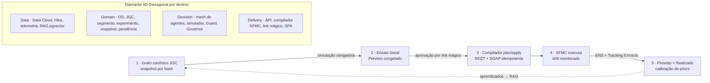

# Jornada 🧬

[](https://github.com/sergiogaiotto/jornada/actions/workflows/ci.yml)

**Digital Twin do Journey Builder (Salesforce Marketing Cloud) — o acelerador fim-a-fim de campanhas da Claro.**

Toda campanha é *pensada, discutida, criada, avaliada, configurada, disparada, monitorada e otimizada* dentro do twin; o SFMC vira o **runtime de execução**, nunca mais a mesa de desenho. Construído por **Spec-Driven Development**: o contrato completo está em [`SDD-Jornada.md`](SDD-Jornada.md), cada decisão em [`CHANGELOG-SDD.md`](CHANGELOG-SDD.md), e **cada critério de aceite do SDD é um teste automatizado com o mesmo ID** (`test_M7_B5`). Divergir do SDD sem emendá-lo é bug.

**🌐 Demo pública:** http://vps.falagaiotto.com.br:8050 · Observabilidade dos agentes (Langfuse): http://vps.falagaiotto.com.br:13000
*Dados 100% sintéticos; autenticação de demonstração; a campanha OS-2026-0457 vem semeada de ponta a ponta. Os agentes de IA rodam no HubGPU real (gpt-oss-120B/20B).*

---

## Os 3 princípios inegociáveis

1. **O twin é a fonte da verdade** — a jornada é um grafo canônico JSON (**JGC**, SDD §5) versionado, com snapshot imutável por hash. Ninguém edita o SFMC diretamente: um **compilador determinístico plan/apply** materializa o grafo (Data Extensions, Event Definitions, Journey, assets) com externalKeys idempotentes, e um **monitor de drift** acusa qualquer edição feita por fora. *Aprovado = publicado = em execução.*
2. **Nada dispara sem ensaio** — a **simulação Monte Carlo** (reprodutível por seed) é QA obrigatório e congela o "Previsto" (P10/P50/P90 de funil, custo, ROAS). Todo KPI do pós-disparo é um par **previsto × realizado**, e o erro recalibra o simulador (closed loop).
3. **IA copilota, humano aprova** — mesh de agentes (Maestro → Triagem → Especialista) sempre como **prévia/diff com Aplicar/Rejeitar**, premissas editáveis e ledger **`via_ai`** reconstruível (LGPD Art. 20). **Compliance é código determinístico, nunca LLM** — o Guard das 7 listas de supressão funciona com o hub de IA fora do ar.

## Da ideia ao disparo — o fluxo em uma imagem

```mermaid
flowchart LR
  NC["➕ Nova Campanha<br/>conversa com o Consultor<br/>OU formulário direto"] -->|completude 100%| OS["OS criada<br/>briefing dinâmico"]
  OS --> VAL["Validação campo a campo<br/>✓ contagem · ✓ schema · ✓ frescor"]
  VAL -->|pendência bloqueia| GO["GO no War Room<br/>congela SLAs e versões"]
  GO --> PROD["Audiência + Criativo<br/>+ Canvas do Twin"]
  PROD --> SIM["Ensaio Geral<br/>Previsto congelado"]
  SIM --> QA["QA: LGPD · experimento<br/>custo/alçada · Governor"]
  QA --> APR["Aprovação<br/>link mágico"]
  APR --> PRE["Pré-voo plan/apply<br/>drift zero"]
  PRE --> RAMP["Rampa canário<br/>1% → 10% → 100%"]
  RAMP --> MON["Monitor<br/>previsto × realizado"]
  MON -->|aprendizados → RAG| NC
```



## Arquitetura — Diamante 4D + loop do twin



**Mesh de agentes** (SDD §7): Consultor de Campanhas (intake conversacional), Engineer (SQL do público), Activate, Flow (gera o JGC), Visual/Copy/Content, Simulate+Persona, Sync/Publish, Insight (NL→consulta nomeada, nunca SQL livre), Optimize (propor é a única ação autônoma), Calibrate, Cost, Doc, Ajuda (chat do Guia) — e o **Guard, que não é LLM**. Skills versionadas em `SKILL.md`, harness com golden dataset como QA de release, tudo com **retry §7.3** (reprompt com o veredito do validador determinístico — nascido de bugs reais do modelo em produção).

## ✨ Destaques do produto

### ➕ Nova Campanha nativa
Botão primário no Cockpit (e na busca ⌘K): cria o pedido e abre a **Sala de Ideação em modo pedido** — converse com o Consultor (120B extrai os campos com evidência "informado pelo solicitante") **ou preencha o formulário direto** (edição inline, Enter salva). O **medidor de completude** sobe ao vivo com os faltantes como chips clicáveis; a 100%, **"Converter em OS"**. A fila de **Pedidos em aberto** vive no Cockpit (abrir/arquivar soft — convertido é imutável). CRUD completo na API (`GET/PATCH/arquivar /pedidos`).

### 🎨 Canvas do Twin — editor nível Journey Builder
- **Paleta de atividades** arrastável nas categorias JB (entry verde, mensagens teal, flow control laranja, otimização roxa, updates azul), com busca;
- **CRUD visual completo**: drop cria nó, arestas por drag, Delete remove, Ctrl+D duplica, **Ctrl+Z/Y** (histórico de 50 passos), auto-layout, MiniMap;
- **Inspetor por tipo de nó** (formulários do §5.2 — split validando Σ pcts = 100, opt-in por canal, waits) e **lint em tempo real** clicável (o 422 do servidor cai no mesmo painel);
- **Versionamento**: dropdown de versões, versões antigas read-only, **restaurar cria versão nova (nunca sobrescreve)** e **diff visual pintado no próprio canvas** (verde=adicionado, fantasma vermelho=removido, âmbar=alterado);
- **Simulação integrada**: overlay dos volumes por aresta da última rodada do Ensaio (espessura proporcional), invalidado ao salvar;
- **Exportação**: **XML canônico validado por XSD** (com manifest: hash JGC, versão, timestamp — determinístico byte a byte) e **JSON na spec de interaction do JB** (o formato de import nativo da Salesforce; o XML atende integração/auditoria corporativa);
- **Taxímetro** sempre visível: Σ volume × tarifa por canal, recalculado a cada mudança.

### 🧭 Guia Interativo (padrão Maestro)
🎯 **Tour das páginas** com spotlight no menu (17 passos navegando de verdade) · 📚 **Guia dos Módulos** · 💡 **Ajuda desta página** (6 abas: O que é, Fundamentos, Campos da tela, Casos de uso, Exemplo prático e **Pegadinhas — escritas a partir dos achados reais do UAT**) · ✨ **"IA, me ajude com esta página"** (chat no 20B com o contexto da tela, degradação educada sem hub).

## As 18 telas

| Fase | Telas |
|---|---|
| Portfólio | T1 Cockpit (+ Nova Campanha, fila de pedidos, kanban, saúde derivada — nunca editável) |
| 1 · Pensada | T2 Sala de Ideação (Consultor IA **ou** formulário inline, medidor de completude, converter em OS) |
| 2 · Discutida | T3 Validação campo-a-campo (✓ contagem · ✓ schema · ✓ frescor; pendência bloqueia) · T4 War Room (GO congela SLAs e versões) |
| 3 · Criada | T5 Audiência (waterfall das 7 listas + SQL + Guard) · T5a Data Cloud (relatório de público e **volume de abordagem**) · T6 Criativo (matriz canal×variante) · T7 **Canvas do Twin** (editor JB completo — ver destaques) |
| 4 · Avaliada | T8 Ensaio Geral (Monte Carlo, seed reprodutível) · T9 **QA** (LGPD, experimento, custo/alçada, Governor) · T10 Aprovação (link mágico standalone, uso único) |
| 5 · Configurada | T11 Pré-voo (plan/apply com diff, seed test, drift zero) |
| 6 · Disparada | T12 Torre de Lançamento (rampa canário 1→10→100%, breakers, kill switch 2 etapas) |
| 7 · Monitorada | T13 Monitor (todo KPI previsto×realizado, IC95) · T14 Pergunte aos Dados (consulta nomeada + query visível) · T15 Otimização & Retro (anti-peeking HTTP 425, clonar com aprendizados) |
| Transversal | T4a Esteira de Produção (workflow ex-Hike, com Criativos e Acompanhamento) · T16 Ateliê de Agentes |

## Stack

| Camada | Tecnologia |
|---|---|
| Backend | Python 3.11 · FastAPI (OpenAPI em `/docs`) · arquitetura hexagonal · RFC-7807 |
| Agentes | LangGraph + Deep-Agent Harness · **HubGPU on-prem**: gpt-oss-120B (especialistas/judge) e 20B (triagens/UI) via endpoint OpenAI-compatible (`api_key: not-needed`) |
| RAG | PostgreSQL + pgvector · Qwen3-Embedding-0.6B (1024 dims, collection `agente_evidence`) |
| Frontend | Vite + React 18 + TypeScript · Tailwind (chrome vermelho Claro) · @xyflow/react (paleta Journey Builder) · Recharts (barra fantasma previsto × sólida realizado) · TanStack Query · zustand · bundle com code-split (chunks < 500 kB) |
| Observabilidade | **Langfuse self-hosted** — 1 trace por invocação (`trace_id = invocacao.id`), spans `rag_retrieve → generate → judge`, fire-and-forget (queda do Langfuse nunca derruba o app) |
| Integrações | SFMC REST + SOAP (mock server com injeção de caos p/ dev) · Salesforce Data Cloud (Segmentation/Query API, mock) · importador de workflows do Hike |
| CI/CD | GitHub Actions: ruff + mypy + pytest (cobertura ≥80%) + build front + validação compose → **deploy automático na VPS via SSH** a cada push verde na main |

## API em destaque (`/docs` para o OpenAPI completo)

| Fluxo | Endpoints |
|---|---|
| Nova Campanha | `POST/GET /pedidos` · `POST /pedidos/{id}/mensagem` (Consultor) · `PATCH /pedidos/{id}/campos` · `POST .../converter` · `POST .../arquivar` |
| Twin | `POST /os/{id}/jornada[/gerar]` · `PUT /jornadas/{id}/grafo` · `GET /os/{id}/jornadas` · `POST /jornadas/{id}/restaurar` · `GET /jornadas/{a}/diff/{b}` · **`GET /jornadas/{id}/export?formato=xml|json`** |
| Avaliação | `POST /jornadas/{id}/simular` · `/congelar-previsto` · `POST /snapshots` → link mágico `GET/POST /aprovacao/{token}` |
| Operação | `POST /snapshots/{id}/plan|apply` · `GET /drift` · `POST /launch/...` · `GET /os/{id}/monitor` · `POST /os/{id}/perguntar` |
| Governança | `POST /os/{id}/validacoes/{campo}` · `/pendencias` · `POST /os/{id}/go` · `POST /segmentos/{id}/certificar` (Guard) |

## Estrutura do repositório

```
├── SDD-Jornada.md            # o contrato (Spec-Driven Development)
├── CHANGELOG-SDD.md          # toda emenda/decisão, datada
├── docs/UAT-VPS-2026-08-05.md# UAT via UI: 10 use cases, 18 achados, reteste
├── docker-compose.yml        # dev: db(pgvector), api, mocks, mailpit, langfuse
├── docker-compose.prod.yml   # demo VPS: web(nginx+SPA):8050, api, mocks, langfuse:13000
├── deploy/deploy.sh          # deploy por git clone/reset na VPS
├── backend/
│   ├── domain/               # puro, sem I/O (campanha, jornada/JGC + XSD de export, simulação…)
│   ├── application/          # ports (Protocols) + services (casos de uso)
│   ├── adapters/             # llm/hubgpu, sfmc, datacloud, langfuse, persistence
│   ├── agents/               # skills/*.skill.md, guard/ (sem LLM), harness/
│   ├── api/v1/               # routers por módulo (M0–M12 + guia do SDD §8)
│   ├── migrations/           # alembic (DDL completo §4.1)
│   └── tests/                # unit · contract (golden files SFMC) · acceptance (test_MX_AN)
├── frontend/
│   ├── src/canvas/           # editor JB: paleta, inspetor, lint, diff visual, overlay
│   ├── src/guia/             # Guia Interativo: tour, conteúdo 18 telas, chat IA
│   └── src/pages/            # as 18 telas
└── mocks/                    # sfmc-server (REST+SOAP+chaos), datacloud-server, seeds
```

## Rodando localmente

```bash
git clone https://github.com/sergiogaiotto/jornada.git && cd jornada
cp .env.example .env             # endpoints do HubGPU já preenchidos; ajuste se necessário
docker compose up -d             # db, api:8000, mock-sfmc, mock-datacloud, mailpit, langfuse:3000
cd frontend && npm ci && npm run dev   # SPA em http://localhost:5173 (proxy /api → :8000)
```

Com `DEMO_MODE=true` (padrão), a **OS-2026-0457 · Upgrade Pós-Pago 5G** nasce semeada de ponta a ponta — briefing 14 campos → GO → certificado LGPD → grafo no canvas (13 nós) → previsto congelado → rampa → monitor com lift +24,1pp (IC95) e ROAS 18,5x. IDs de seed são **determinísticos** (uuid5): links sobrevivem a restarts.

**Qualidade:**

```bash
cd backend && python -m pytest -m "not integration" -q   # 169 testes; aceites = IDs do SDD
python -m ruff check . && python -m ruff format --check . && python -m mypy app api
```

Sem o hub LLM acessível, os agentes degradam para **503 + modo manual** (SDD §10.6) — o caminho crítico (Guard, compilador, breakers, kill switch, editor do canvas, export) é 100% determinístico e segue funcionando; um e2e prova isso com `LLM_DEGRADED_MODE=forced_off`.

## Deploy (VPS)

```bash
curl -fsSL https://raw.githubusercontent.com/sergiogaiotto/jornada/main/deploy/deploy.sh | bash -s -- --local
```

Sobe `web` (nginx + SPA, porta **8050**), `api`, mocks e Langfuse (**:13000**, signup desabilitado; segredos gerados na própria VPS, fora do git). Em produção contínua, o job `deploy` do CI faz isso automaticamente a cada push verde na main (chave SSH dedicada em secret, smoke pós-deploy). HTTPS: nginx + certbot prontos, aguardando o DNS `jornada.falagaiotto.com.br → 187.77.46.137`.

## Glossário do vocabulário canônico

| Termo | Significado |
|---|---|
| **Twin / JGC** | O grafo canônico da jornada (JSON versionado, hash content-addressable) — a fonte da verdade que compila para o SFMC |
| **QA** | Checkpoint bloqueante entre fases (certificado LGPD, experimento pré-registrado, custo/alçada, Governor). *Nome de UI do conceito "portão/gate"* |
| **Pendência** | Item bloqueante herdado do Hike (resolução ou aceite formal do Accountable destravam) — *não existe "RAID" aqui* |
| **Previsto** | Baseline congelado pela simulação — a régua imutável do pós-disparo |
| **`via_ai`** | Ledger de toda ação de agente (prompt, evidências, humano que aceitou) — reconstruível para a LGPD Art. 20 |
| **Drift** | Divergência entre o twin e o que está vivo no SFMC — gera pendência automática |
| **Guard / Governor** | Validadores determinísticos (7 listas + opt-in / pressão de contato cross-campanha) — **nunca LLM** |

## Estado & histórico

- **Milestones auditados** `vMS5`–`vMS8`: M0–M12 do SDD com auditoria cética por milestone.
- **2026-08-05 · Validação com o hub real**: 120B/20B/embeddings confirmados; nasce o padrão retry §7.3 (o modelo real "conversa sem estruturar" — o FakeLLM nunca pegaria).
- **2026-08-05 · UAT via UI na VPS**: 10 use cases, **18 achados** (7 invisíveis a testes sintéticos), 9 corrigidos e retestados no dia — [`docs/UAT-VPS-2026-08-05.md`](docs/UAT-VPS-2026-08-05.md).
- **2026-08-05 · Guia Interativo** (tour, módulos, ajuda contextual, chat IA) · **rename Portão→QA** · **canvas editor JB** (versões, diff visual, export XML/JSON) · **Nova Campanha nativa** (Portal do Solicitante aposentado — achado A3 resolvido).
- **2026-08-06 · Produção de verdade:** **persistência PostgreSQL** em todos os agregados (A7 — provado na VPS: pedido criado sobrevive ao restart do container) · **RAG operante** (A11 — 17 chunks do dicionário no pgvector; o Engineer gera SQL com opt-in por canal e as 7 listas no `NOT EXISTS`) · **evidências de compliance pinadas** (A24) · **version-stamp de deploy** (A22 — `/healthz.sha` e o CI falhando em "deploy-fantasma") · achados A8/A9/A18/A23. **209 testes** (196 + 13 de integração em Postgres real no CI).

**Pendências conhecidas (honestidade de produto):**
1. **HTTPS** — aguardando o registro DNS `jornada.falagaiotto.com.br → 187.77.46.137` (nginx + certbot já prontos na VPS).
2. **Escopo do mypy** limitado a `app` + `api`: os adapters e services novos não são checados por tipo (gate dá menos garantia do que aparenta).
3. **Benchmark do painel do Criativo (T6)** ainda é texto fixo de mock — com o RAG real ativo, deve virar consulta ao retriever ou sair da tela.

## Contribuindo (o jeito SDD)

1. Leia o [`SDD-Jornada.md`](SDD-Jornada.md) — ele é o contrato; toda divergência exige emenda + entrada no CHANGELOG **no mesmo PR** (§1.3.3).
2. Contratos primeiro (OpenAPI/Pydantic/DDL/testes de aceite), implementação depois; aceites viram testes com o mesmo ID.
3. LLM nunca no caminho crítico; PII nunca em prompt; SFMC/Data Cloud reais nunca em teste (use os mocks).
4. Push na main só com os 4 gates verdes — e ele **deploya sozinho**.

---

*Projeto de estudo/aceleração construído em pair com IA (Claude) sob Spec-Driven Development — especificação primeiro, auditoria cética por milestone, e a regra de ouro: LLM nunca decide elegibilidade de contato, nunca publica sozinho, nunca altera jornada no ar.*
